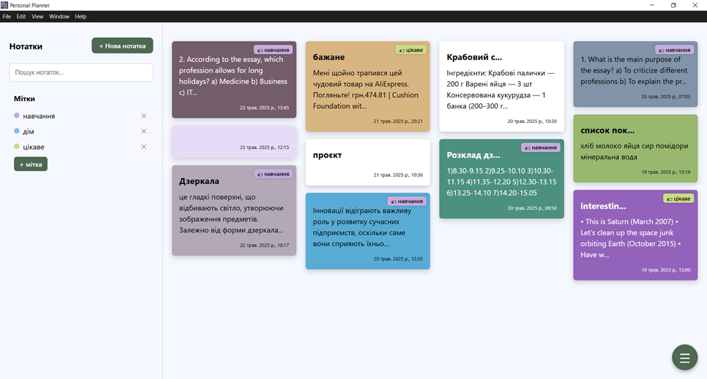

# Додаток для планування персональної діяльності

Настільний додаток для планування та організації особистої діяльності користувача, що дозволяє керувати завданнями, подіями та розкладом, організовувати роботу з нотатками, а також відстежувати продуктивність.

## Функціональні можливості:

- управління завданнями, встановлення пріоритетів, дати та часу виконання, перегляд повного списку завдань;
- організація подій із зазначенням пріоритету, початкової та кінцевої дати, а також опису. Інтеграція з календарем для швидкого перегляду та редагування графіка;
- ведення нотаток, додавання міток для зручної організації текстових записів, функції оновлення та видалення нотаток;
- відображення нагадувань за годину до запланованого завдання або події та в момент їх початку;
- впорядкування завдань, подій і нотаток за різними критеріями для швидкого доступу;
- пошук за ключовими словами або фрагментами тексту серед усіх елементів системи;
- візуалізація показників виконання завдань і відстеження продуктивності користувача;
- ведення запису дій користувача у додатку для аналізу діяльності та підвищення безпеки.

## Використані технології

- **Мова програмування:** JavaScript
- **Фреймворки:** Vue.js, Electron
- **СУБД:** SQLite
- **Інструменти:** Node.js, npm

## Структура системи та база даних

#### Логічна структура

Застосунок реалізовано як односторінковий додаток (SPA). Його структура організована навколо головної сторінки, що є точкою входу та центральним елементом взаємодії користувача із системою.

Основну частину програми становлять три головні компоненти:
- **завдання:** керування списком особистих справ, встановлення відміток про їх виконання;    
- **події:** планування заходів з прив'язкою до дати і часу, їх відображення у календарному представленні;
- **нотатки:** зберігання, перегляд та редагування довільної текстової інформації.

Додатковими компонентами системи є:
- **журнал активності**, в якому ведеться облік виконаних користувачем дій із зазначенням параметрів, що дозволяє ідентифікувати об’єкт, визначити тип операції та відстежити дату і час.
- **систему налаштувань**: вибір кольорової теми інтерфейсу та налаштування PIN-коду для захисту доступу до функцій застосунку.

Робота з даними організована через локальний API, який обробляє HTTP-запити від клієнтської частини та забезпечує виконання CRUD-операцій у базі даних. Кожен компонент працює зі своїм специфічним набором даних.

#### База даних

База даних включає такі сутності:

| Сутність         | Призначення                                  |
| ---------------- | -------------------------------------------- |
| `tasks`          | Завдання                                     |
| `events`         | Заплановані події/зустрічі                   |
| `notes`          | Нотатки                                      |
| `labels`         | Мітки                                        |
| `audit_log`      | Журнал дій користувача                       |
| `user_settings`  | Налаштування інтерфейсу та поведінки додатка |
| `security_state` | Параметри доступу та безпеки                 |
| `priority`       | Пріоритети завдань та подій                  |
| **`status`**     | Поточний статус завдань і подій              |
| **`item_type`**  | Тип об’єкта (завдання, подія, нотатка)       |

**Взаємозв’язки один-до-багатьох (1:N)** між сутностями дозволяють одному запису джерела відповідати багатьом записам пов’язаних таблиць.

## Інтерфейс користувача

  
***Головна сторінка***

  
***Список завдань***

  
***Статистика виконання завдань за останній тиждень***

  
***Інтерактивний календар***

  
***Сторінка з нотатками***

  
***Журнал активності користувача***

  
***Кольорові теми, доступні для використання в додатку***

## Запуск проєкту

1. Клонувати репозиторій:  
	`git clone https://github.com/opyvonos/personal-planner`
2. Встановити залежності:  
	`npm install`
3. Запустити застосунок в режимі розробки:  
	`npm run dev`
4. Зібрати додаток для персонального комп'ютера:  
	`npm run build`